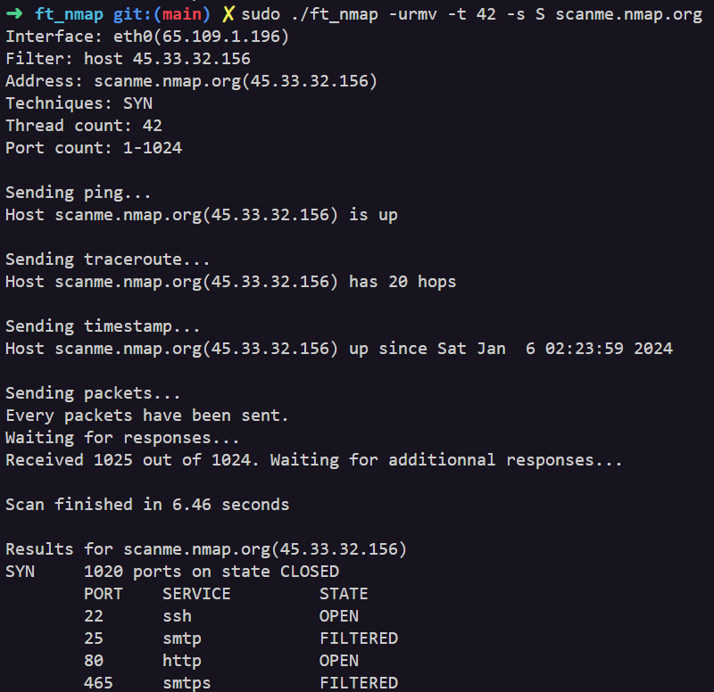

# ft_nmap

Simple reimplementation of the command `nmap` in C.

ft_nmap is a network scanning tool modeled after `nmap`. It supports both **IPv4** and **IPv6**, capable of executing various `TCP` (ACK, SYN, FIN, NULL, XMAS) and `UDP` scans. Besides port scanning, it can perform service detection, traceroute, uptime detection and ping scans. It's able to be threaded up to 250 threads.

# Usage

Do `make` and then run :

```bash
sudo ./ft_nmap [-h6urvVm] [-p ports] [-s techniques] [-f file] [-t threads] <host>
```



> You are requiered to run the program with sudo because the program uses raw sockets (`SOCK_RAW` with the socket function for the sending socket).

The following options and arguments are handled by the program:

```bash
options:
        -h:                             display this help
        -p <ports>:                     scan the specified ports (default: 1-1024, eg. 1-5,80)
        -s <techniques>:                scan with the specified techniques (default: ASFNXU)
                                        A: ACK, S: SYN, F: FIN, N: NULL, X: XMAS, U: UDP
        -f <file>:                      scan the specified hosts within the file (<host> not needed)
        -t <threads>:                   scan with the specified amount of threads (default: 0)
        -6:                             use IPv6
        -u:                             ping host before scanning
        -r:                             traceroute host before scanning
        -v:                             verbose mode
        -V:                             very verbose mode
        -m:                             check the uptime of the host

arguments:
        <host>:                         host to scan
```

# Docs
First of, you should read the docs recommended in our [ft_ping](https://github.com/execrate0/ft_ping#Docs) and [ft_traceroute](https://github.com/assxios/ft_traceroute#Docs) projects.

The only documentation we used for this project is from [nmap.org](https://nmap.org), which is the official documentation of the `nmap` command. It's very complete and explains everything you need to know about network scanning.

We have made simple diagrams for each scan techniques, which you can find below:

- ACK:


- SYN:


- FIN NULL XMAS:


- UDP:


## MADE WITH LOVE BY :

<!-- ALL-CONTRIBUTORS-LIST:START - Do not remove or modify this section -->
<!-- prettier-ignore-start -->
<!-- markdownlint-disable -->
<table>
  <tr>
    <td align="center"><a href="https://github.com/alexandre-hallaine/"><br /><sub><b>Alexandre Hallaine (ahallain)</b></sub></a><br /><a href="https://profile.intra.42.fr/users/ahallain" title="Intra 42"></a></td>
    <td align="center"><a href="https://github.com/assxios/"><br /><sub><b>Assxios (droge)</b></sub></a><br /><a href="https://profile.intra.42.fr/users/droge" title="Intra 42"></a></td>
  </tr>
</table>
<!-- markdownlint-restore -->
<!-- prettier-ignore-end -->
<!-- ALL-CONTRIBUTORS-LIST:END -->